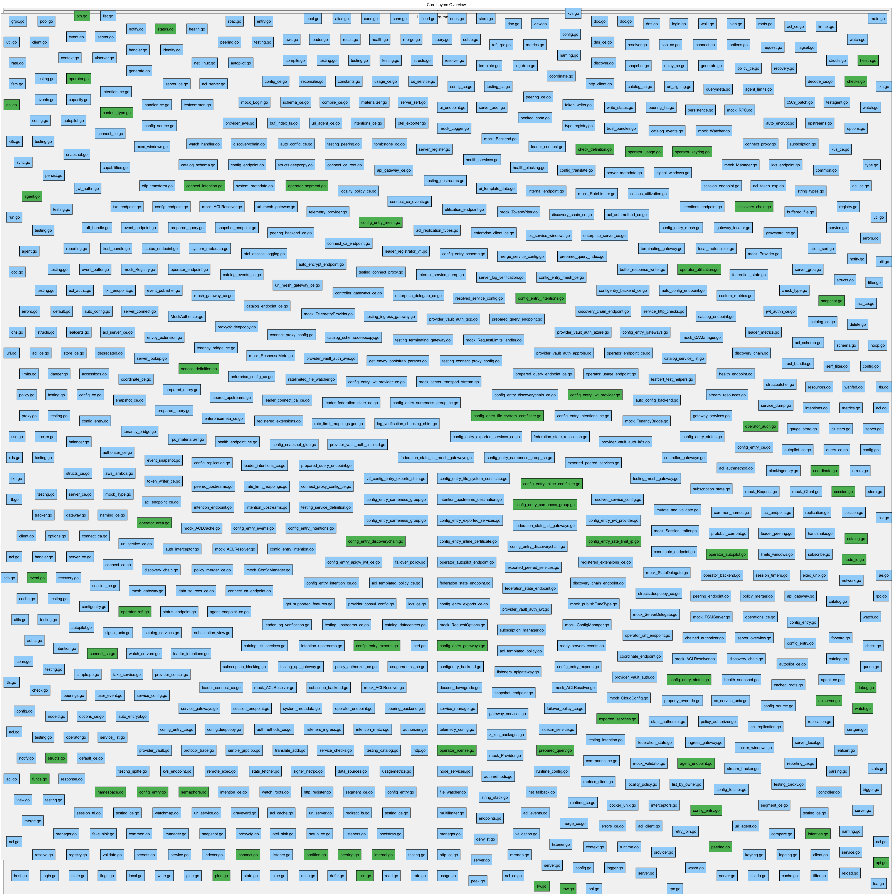
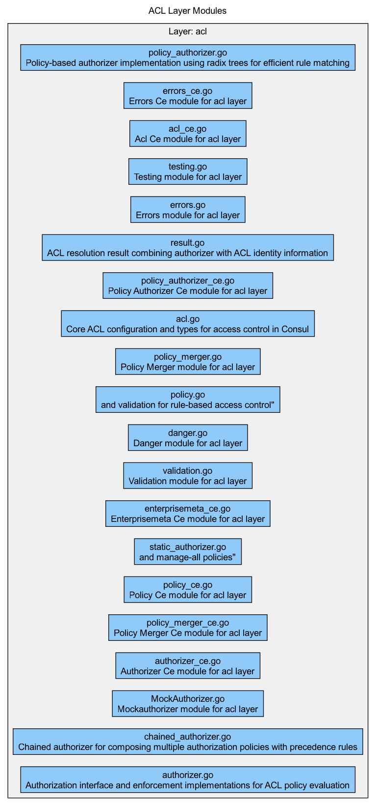
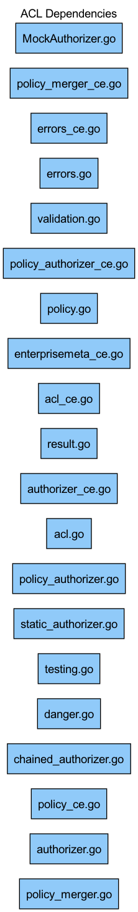
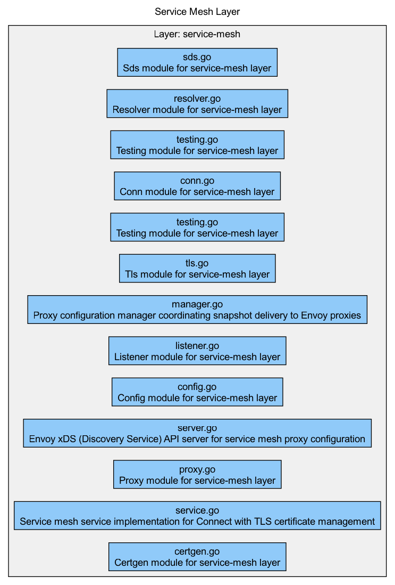
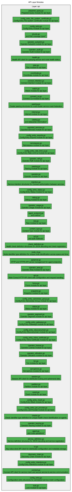

# Consul Architecture Visualizations

Auto-generated GraphViz diagrams from GraphFS semantic metadata showing the architectural structure and module relationships.

---

## Core Layers Overview

High-level view of the main architectural layers (agent, ACL, API, service-mesh).



**Layers shown:**
- **Agent Layer** (692 modules) - Core agent runtime and functionality
- **ACL Layer** (20 modules) - Access control and authorization
- **API Layer** (62 modules) - Public API client library
- **Service Mesh** (13 modules) - Connect service mesh components

---

## ACL Layer Architecture

Complete ACL (Access Control List) layer showing all 20 modules and their organization.



**Key components:**
- Authorizer interfaces and implementations
- Policy management and validation
- Resolver and caching
- Static and chained authorizers

**Query to reproduce:**
```sparql
SELECT ?s WHERE {
  ?s <https://schema.codedoc.org/layer> "acl"
}
```

---

## ACL Dependencies

Dependency relationships within the ACL layer.



**Note:** Due to GraphFS Issue #74, relationship traversal is limited. When resolved, this will show full dependency chains.

---

## Service Mesh Layer

Service mesh (Connect) components and architecture.



**Components:**
- Proxy configuration and management
- Certificate generation
- TLS handling
- Connection management
- XDS server integration

**Query to reproduce:**
```sparql
SELECT ?s WHERE {
  ?s <https://schema.codedoc.org/layer> "service-mesh"
}
```

---

## API Layer

Public API client library modules.



**Coverage:**
- 62 API client modules
- Catalog, Health, KV, Session, ACL, Config Entry APIs
- Connect, Namespace, Peering APIs
- Operator and Status endpoints

---

## How These Were Generated

All visualizations are auto-generated from GraphFS semantic metadata:

```bash
# ACL layer visualization
graphfs viz --format png --type layer --layer acl \
  --title "ACL Layer Modules" --color-by layer --labels \
  --output diagrams/acl-layer.png

# Service mesh visualization
graphfs viz --format png --type layer --layer service-mesh \
  --title "Service Mesh Layer" --color-by layer --labels \
  --output diagrams/service-mesh-layer.png

# Core layers overview
graphfs viz --format png --type layer \
  --layer agent --layer acl --layer api --layer service-mesh \
  --title "Core Layers Overview" --color-by layer --layout neato \
  --output diagrams/core-layers.png

# ACL dependencies
graphfs viz --format png --type dependency --layer acl \
  --title "ACL Dependencies" --layout dot \
  --output diagrams/acl-dependencies.png
```

---

## Statistics

| Layer | Modules | Visual |
|-------|---------|--------|
| **agent** | 692 | Core runtime |
| **internal** | 484 | Utilities |
| **cli** | 184 | Commands |
| **api** | 62 | Client library |
| **acl** | 20 | Authorization |
| **service-mesh** | 13 | Connect |
| **grpc** | 6 | gRPC services |
| **rpc** | 3 | RPC endpoints |
| **consensus** | 2 | Raft |
| **security** | 2 | TLS/Security |
| **storage** | 1 | State store |

**Total**: 1,470 modules across 11 layers

---

## Next Steps

- **Query the graph**: Use SPARQL to explore relationships
- **Filter by tags**: Find cross-cutting concerns (security, networking, etc.)
- **Impact analysis**: Understand refactoring implications
- **Generate custom views**: Create focused diagrams for your use case

---

**Generated**: 2025-11-19
**GraphFS Version**: Latest
**Visualization Engine**: GraphViz (dot, neato layouts)
